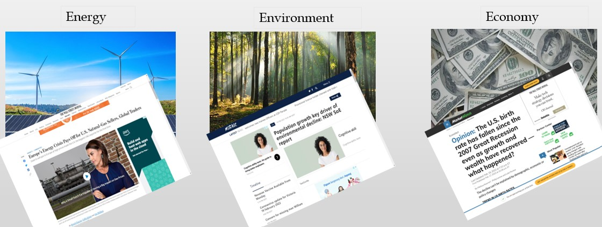

```{r include = FALSE}
path = dirname(rstudioapi::getSourceEditorContext()$path)
setwd(path)
library(shiny)
library(shinyjs)
library(dplyr)
library(knitr)
library(kableExtra)
library(keras)

```


# Introduction

## Intro {.sidebar}

World Population

* Introduction
* Methodology
* World Data
* Countries Data
* Forecasting
* Map Visualization
* Conclusion
* Source Code


## Column 1

### Introduction

```{r echo = FALSE}

```
#### Why forecast the world population?
Forecast world population is an essential metric for world and humanity decisions. It will help United Nations make decisions for the sustainability of the planet's environment, energy, economy, health care, and others. On the other hand, each country has decentralization power to manage its people. Each country will also need a population projection to do the same thing for its area.

#### Who use world population data?
```{r echo=FALSE, out.width="80%"}

```

## Column 2

### Critical Use Case
#### Covid19 Pandemic
Covid19 has impacted the world in any aspect. Projection of the world population, in that case, is crucial for preventing the next pandemic.

```{r echo=FALSE, out.width="36%"}

```


### Other Use Case
```{r echo=FALSE, out.width="100%"}

```

# Methodology
## Intro {.sidebar}
Methodology

* Sliding Window Time Series Analysis Modeling
* Multi-Layer Perceptron Neural Network

Analytical Tools

* R Programming
* R Shiny
* TensorFlow

## Step
#### Sliding Window Time Series Analysis Modeling
```{r echo=FALSE, out.width="100%"}

```


#### Multi-Layer Perceptron Neural Network
```{r echo=FALSE, out.width="100%"}
knitr::include_graphics("./forecasting.jpg")
```

# World Data

## Intro {.sidebar}
The data is annual time-series data from The World Bank. This data is the total annual population variable for 214 countries with valid data from 1960 – 2020.

Not Valid data: Eritrea, Kuwait, West Bank, and Gaza

The data from 2021 - 2030 is forecasting results using the Multi-Layer Perceptron (MLP) neural network available on the "forecasting" page.

## Column 1

```{r, echo=FALSE}

shinyAppFile("./world.R",
  options = list(
    width = "100%", height = 600
  )
)

```

# Countries Data
## Intro {.sidebar}
This page provides interactive comparison, rank, and data filtering for 214 countries plus the total world population. 

This data visualization is also available for forecasting results in 2021 - 2030.

## Column 1
```{r, echo=FALSE}

shinyAppFile("./country.R",
  options = list(
    width = "100%", height = 800
  )
)
```


# Forecasting
## Column 1
```{r, echo=FALSE}

shinyAppFile("./forecasting.R",
  options = list(
    width = "100%", height = 600
  )
)
```


# Map Visualization
## Column 1
```{r, echo=FALSE}
shinyAppFile("./map.R",
  options = list(
    width = "100%", height = 700
  )
)

```

# Conclusion

## Column 1
### Multilayer Perceptron + SWTS to Predict World Population

MLP and Sliding Window Time Series Analysis are good predictors for forecasting country and world population. In this research, we found the SWTS + MLP method obtain 7.41% MAPE to predict the population in the world for the next ten years. This result can be considered the methodology for the government to predict the world population to make better policy decisions.

## Column 2
### Shiny Application

With Shiny visualization we can:

* Visualize the line chart of the population interactively
* Visualize the box-plot of the population interactively
* Compare countries population interactively
* Load TensorFlow model to predict population interactively
* Visualize map for the population interactively
* Filter population data interactively by country or year
* Rank population data interactively by year
* Summarize population interactively

# Source Code
## Intro {.sidebar}
This application required R programming, Shinny, TensorFlow, and some additional libraries. The main.Rmd files not described in this page. 

Packages:

keras, shiny, shinyjs, dplyr, knitr ,kableExtra ,plotly, sf ,rnaturalearth, rnaturalearthdata, scales, psych ,rmarkdown, reshape ,ggplot2, reticulate


## Column 1
```{r, echo=FALSE}

shinyAppFile("./code.R",
  options = list(
    width = "100%", height = 600
  )
)
```